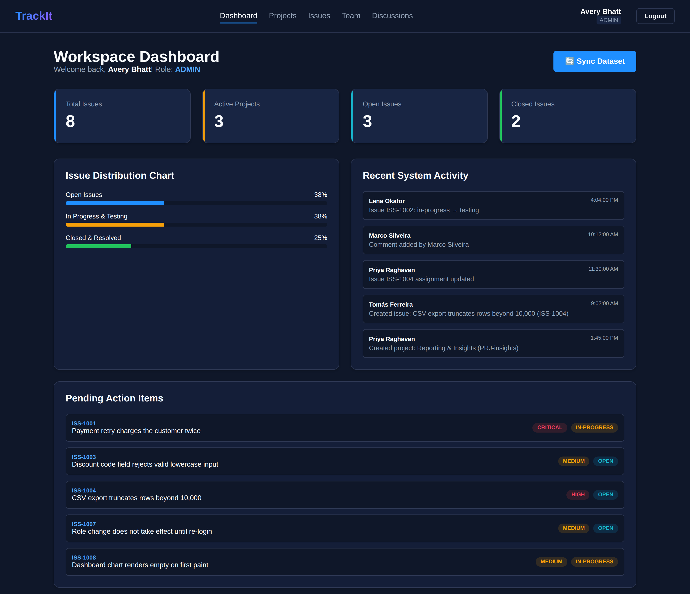
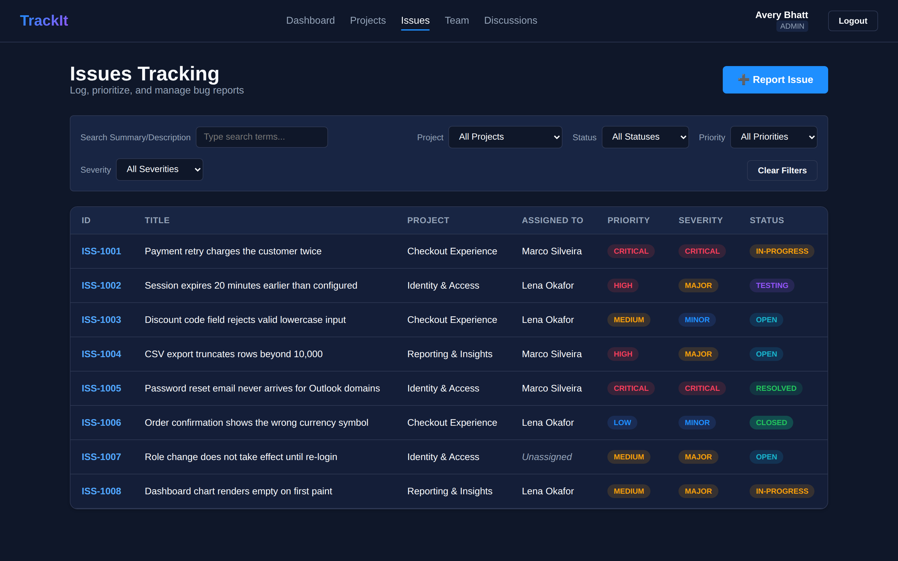
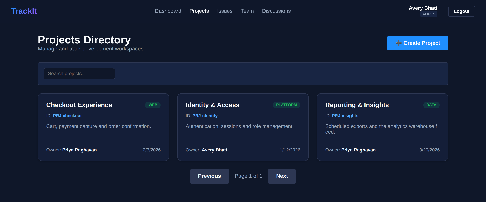
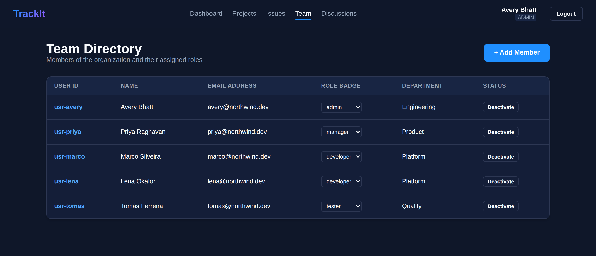
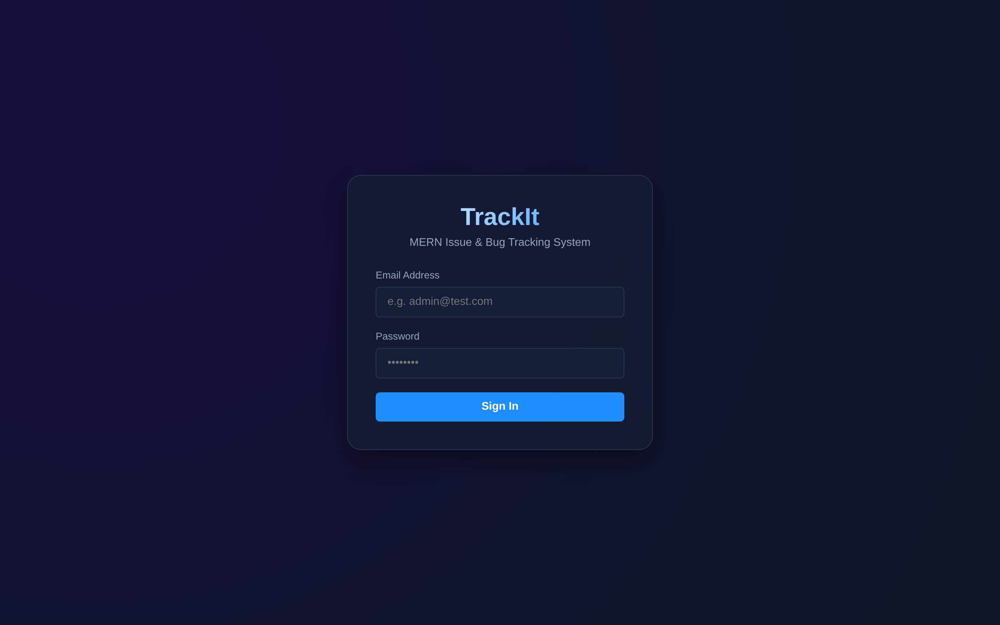

<div align="center">

# TrackIt

**An issue and bug tracking system for software teams, built on the MERN stack.**

Projects, issues with an enforced review workflow, threaded discussion, and
analytics — with permissions that hold at the API, not just in the interface.

[](https://github.com/Sandeepsrinivasan-14/trackit/actions/workflows/ci.yml)
[](LICENSE)
[](https://nodejs.org)
[](https://react.dev)
[](https://www.mongodb.com)
[](Dockerfile)
[](backend/tests)

[Deploy your own](#deploy-your-own) · [Quick start](#quick-start) · [API reference](#api-reference) · [Architecture](#architecture) · [Contributing](CONTRIBUTING.md)

</div>

---

<div align="center">
  
</div>

---

## Contents

- [Why TrackIt](#why-trackit)
- [Screenshots](#screenshots)
- [Deploy your own](#deploy-your-own)
- [Quick start](#quick-start)
- [Roles and permissions](#roles-and-permissions)
- [The issue workflow](#the-issue-workflow)
- [Architecture](#architecture)
- [Configuration](#configuration)
- [API reference](#api-reference)
- [Testing](#testing)
- [Security](#security)
- [Roadmap](#roadmap)
- [License](#license)

## Why TrackIt

Most tracker projects stop at create-read-update-delete. TrackIt's substance is
in the rules that sit on top of the data:

**Permissions are enforced server-side.** A developer can update an issue only
when it is assigned to them. A tester can comment but cannot edit. Only the
assigned developer can move work into testing. None of this depends on the
frontend hiding a button — every rule is a check in the API, and every rule has
a test proving it rejects the request.

**The workflow has memory.** A closed issue cannot quietly slide back to
in-progress; it has to be reopened first. Reassignment on a closed issue is
refused. Every transition writes an audit record naming who moved what, from
which state to which.

**It is built to be operated, not just run.** Configuration is validated at
startup and the process refuses to boot on a weak signing secret rather than
failing later as a confusing 500. Health checks report database state.
Shutdown is graceful. Logs are structured JSON in production. There is a smoke
test you point at a live deployment.

## Screenshots

<table>
  <tr>
    <td width="50%">
      <br>
      <sub><b>Issue tracking</b> — filter by project, status, priority, severity, or full-text search across titles and descriptions.</sub>
    </td>
    <td width="50%">
      <br>
      <sub><b>Projects</b> — group issues into workspaces, each with an owner and members.</sub>
    </td>
  </tr>
  <tr>
    <td width="50%">
      <br>
      <sub><b>Team directory</b> — who is on the team. Administrators add members and change roles inline.</sub>
    </td>
    <td width="50%">
      <br>
      <sub><b>Authentication</b> — JWT-based sessions with rate-limited sign-in.</sub>
    </td>
  </tr>
</table>

> Screenshots are generated from the real interface by
> [`docs/screenshots-harness.js`](docs/screenshots-harness.js), which drives the
> production build against fixture data.

## Deploy your own

TrackIt ships as a **single container** that serves both the API and the
compiled React app, so there is no second deployment to keep in sync.

[](https://railway.com/new)

<details>
<summary><b>Railway, step by step</b></summary>

1. At [railway.app](https://railway.app), choose **Deploy from GitHub repo** and
   select this repository. Railway reads [`railway.json`](railway.json) and
   builds the [`Dockerfile`](Dockerfile) automatically.
2. In the same project, add **New → Database → MongoDB**.
3. On the app service, open **Variables** and set:

   | Variable | Value |
   | --- | --- |
   | `MONGODB_URI` | `${{MongoDB.MONGO_URL}}` |
   | `JWT_SECRET` | 48 random bytes — `openssl rand -hex 48` |
   | `CORS_ORIGINS` | your Railway URL |
   | `ADMIN_EMAIL` | the address you will sign in with |
   | `ADMIN_PASSWORD` | 12 characters or more |

   `NODE_ENV`, `PORT`, `SERVE_FRONTEND` and `TRUST_PROXY` are already set inside
   the image.
4. Deploy, then check `https://<your-url>/health` reports
   `"database": "connected"` and sign in at the root URL.

</details>

<details>
<summary><b>Any Docker host</b></summary>

```bash
docker build -t trackit .

docker run -p 5000:5000 \
  -e MONGODB_URI="mongodb+srv://…" \
  -e JWT_SECRET="$(openssl rand -hex 48)" \
  -e CORS_ORIGINS="https://yourdomain.com" \
  -e ADMIN_EMAIL="you@yourdomain.com" \
  -e ADMIN_PASSWORD="a-strong-password" \
  trackit
```

</details>

<details>
<summary><b>Vercel for the frontend, Railway for the API</b></summary>

The SPA is a static bundle, so it can live on Vercel while the API runs
elsewhere. Two settings make the pair work:

1. **On Vercel** — set the project's root directory to `frontend`, then add an
   environment variable:

   | Variable | Value |
   | --- | --- |
   | `REACT_APP_API_URL` | `https://your-api.up.railway.app/api` |

   This is read at *build* time, so redeploy after changing it. Without it the
   bundle calls `/api` on the Vercel domain, where no API is listening, and
   every request fails.

   [`frontend/vercel.json`](frontend/vercel.json) already supplies the rewrite
   that lets client-side routes such as `/issues` survive a page refresh.

2. **On the API** — deploy with `SERVE_FRONTEND=false` and add the Vercel domain
   to `CORS_ORIGINS`, or the browser will block the responses.

Building the same bundle locally:

```bash
cd frontend
REACT_APP_API_URL=https://your-api.example.com/api npm run build
```

</details>

## Quick start

### With Docker — nothing else to install

```bash
git clone https://github.com/Sandeepsrinivasan-14/trackit.git
cd trackit

cp .env.example .env
node -e "console.log(require('crypto').randomBytes(48).toString('hex'))"
# paste the output into JWT_SECRET in .env

docker compose up --build
```

The application, database included, is on <http://localhost:5000>.

### Without Docker

Requires Node.js 20+ and a reachable MongoDB.

```bash
cp .env.example .env        # set MONGODB_URI and JWT_SECRET

npm run install:all
npm run seed -- --sample    # demo accounts, projects and issues

npm run dev                 # API on :5000
npm run dev:frontend        # SPA on :3000
```

The seeder prints the generated demo passwords once. Set `SEED_DEMO_PASSWORD`
beforehand to choose them yourself.

## Roles and permissions

Four roles, checked on every request:

| Capability | Admin | Manager | Developer | Tester |
| --- | :-: | :-: | :-: | :-: |
| View projects, issues, comments, analytics | ● | ● | ● | ● |
| Create, edit, delete projects | ● | ● | — | — |
| Create and delete issues | ● | ● | — | — |
| Assign issues | ● | ● | — | — |
| Edit issues | ● | ● | assigned only | — |
| Move an issue to `testing` | ● | ● | assigned only | — |
| Resolve or close an issue | ● | ● | ● | — |
| Add comments | ● | ● | ● | ● |
| Delete comments | any | own | own | own |
| Change your own password | ● | ● | ● | ● |
| Add a team member | ● | — | — | — |
| Change a member's role or status | ● | — | — | — |
| Trigger dataset sync | ● | ● | — | — |

## The issue workflow

```
   ┌────────┐   ┌─────────────┐   ┌─────────┐   ┌──────────┐   ┌────────┐
   │  open  │──▶│ in-progress │──▶│ testing │──▶│ resolved │──▶│ closed │
   └────────┘   └─────────────┘   └─────────┘   └──────────┘   └────────┘
        ▲                                                           │
        └───────────────────── reopen ──────────────────────────────┘
```

The constraints that make it a workflow rather than a dropdown:

- A **closed** issue can only move to `open`. Nothing else is accepted.
- A closed issue **cannot be reassigned** without being reopened first.
- Only the **assigned developer** may move an issue into `testing`.
- **Testers** cannot resolve or close; they report and they comment.
- A **resolved** issue cannot be edited in place — reopen it to make changes.
- Issue titles are **unique within a project**, enforced by the API and by a
  database index so concurrent creates cannot slip past the check.

Every transition writes an `ActivityLog` entry recording the actor, the previous
status and the new one.

## Architecture

```
trackit/
├── backend/                      Express + Mongoose REST API
│   ├── server.js                 entrypoint: validate config, connect, listen, shut down cleanly
│   ├── scripts/
│   │   ├── seed.js               demo accounts and sample data
│   │   └── smoke.js              post-deployment verification against a live URL
│   ├── tests/                    99 cases — Jest + Supertest + in-memory MongoDB
│   └── src/
│       ├── app.js                Express wiring only; no database, so tests can import it
│       ├── config/               validated environment configuration
│       ├── controllers/          request handling and business rules
│       ├── middleware/           auth, validation, rate limiting, error handling
│       ├── models/               Mongoose schemas and indexes
│       ├── routes/               route tables
│       ├── services/             seeding
│       ├── utils/                logger, typed errors, shared query helpers
│       └── validators/           Zod request schemas
├── frontend/                     React 19 SPA
├── docs/screenshots/             interface screenshots used above
├── Dockerfile                    multi-stage: builds the SPA, serves both from one image
├── docker-compose.yml            local stack including MongoDB
└── railway.json                  Railway deployment configuration
```

**Request lifecycle.** A request passes through helmet and CORS, a rate limiter,
JSON parsing, then its route. The route attaches authentication, a role check,
and a Zod schema before the controller runs — so a controller can trust that
`req.user` exists, holds a permitted role, and that `req.body` is the right
shape. Controllers throw `ApiError`; a central handler turns that into a
response and makes sure nothing internal leaks out.

**Identifiers.** Every endpoint accepts either a Mongo `_id` or the
human-readable business id (`PRJ-…`, `ISS-…`, `usr-…`). One helper implements
that, rather than the branch being repeated in each handler.

**API mounting.** Routes live under `/api`. They are also mounted at the bare
root for older clients — except when this process serves the SPA, since
`/issues` and `/projects` are then the frontend's own browser routes. See
`ENABLE_LEGACY_ROOT_ROUTES`.

## Configuration

Every setting is an environment variable. [`.env.example`](.env.example) is the
annotated reference. The server validates configuration at startup and exits
with a readable message rather than starting in a broken state.

| Variable | Required | Description |
| --- | :-: | --- |
| `MONGODB_URI` | ● | MongoDB connection string |
| `JWT_SECRET` | ● | Token signing secret, minimum 32 characters |
| `PORT` | | Listen port (default `5000`) |
| `JWT_EXPIRES_IN` | | Token lifetime (default `24h`) |
| `CORS_ORIGINS` | | Comma-separated allowed origins; `*` is rejected in production |
| `SERVE_FRONTEND` | | Serve the compiled SPA from this process |
| `TRUST_PROXY` | | Set behind a load balancer so rate limits see real client IPs |
| `ADMIN_EMAIL` / `ADMIN_PASSWORD` | | Provision the first administrator at boot |
| `ALLOW_PUBLIC_REGISTRATION` | | Let anyone create an account (default: development only) |
| `DEFAULT_REGISTRATION_ROLE` | | Role given to self-registered accounts (default `developer`) |
| `SEED_DEMO_USERS` | | Create the four demo accounts (default: development only) |
| `SEED_DEMO_PASSWORD` | | Fixed password for demo accounts; random if unset |
| `RATE_LIMIT_MAX` | | Requests per window (default `300`) |
| `AUTH_RATE_LIMIT_MAX` | | Sign-in attempts per window (default `10`) |

## API reference

Base path `/api`. Every route except `/health`, `/auth/register` and
`/auth/login` requires `Authorization: Bearer <token>`. Responses are shaped
`{ success, message?, data? }`.

<details open>
<summary><b>Authentication</b></summary>

| Method | Endpoint | Access | Description |
| --- | --- | --- | --- |
| `POST` | `/auth/register` | public\* | Create an account |
| `POST` | `/auth/login` | public | Exchange credentials for a JWT |
| `GET` | `/auth/me` | any | The authenticated user |
| `PATCH` | `/auth/password` | any | Change your own password |

\* Self-registration is enabled in development and disabled in production by
default; see `ALLOW_PUBLIC_REGISTRATION`. **A caller can never choose their own
role.** Self-registered accounts always receive `DEFAULT_REGISTRATION_ROLE`; only
an administrator, passing their own token, may create an account with a
specified role.

```bash
curl -X POST https://your-app/api/auth/login \
  -H 'Content-Type: application/json' \
  -d '{"email":"you@example.com","password":"your-password"}'
```

</details>

<details>
<summary><b>Issues</b></summary>

| Method | Endpoint | Access |
| --- | --- | --- |
| `GET` | `/issues` | any |
| `GET` | `/issues/:id` | any — includes comments |
| `POST` | `/issues` | admin, manager |
| `PATCH` | `/issues/:id` | admin, manager, assigned developer |
| `PATCH` | `/issues/:id/assign` | admin, manager |
| `PATCH` | `/issues/:id/status` | any, subject to workflow rules |
| `DELETE` | `/issues/:id` | admin, manager |
| `POST` | `/issues/:id/comments` | any |

Query parameters on `GET /issues`: `project`, `status`, `priority`, `severity`,
`assignedTo`, `search`, `page`, `limit`. Page size is capped at 100.

```bash
curl 'https://your-app/api/issues?status=open&priority=critical&limit=20' \
  -H "Authorization: Bearer $TOKEN"
```

</details>

<details>
<summary><b>Projects</b></summary>

| Method | Endpoint | Access |
| --- | --- | --- |
| `GET` | `/projects` | any — filters: `status`, `owner` |
| `GET` | `/projects/:id` | any |
| `POST` | `/projects` | admin, manager |
| `PATCH` | `/projects/:id` | admin, manager |
| `DELETE` | `/projects/:id` | admin, manager |

</details>

<details>
<summary><b>Comments, team and analytics</b></summary>

| Method | Endpoint | Access |
| --- | --- | --- |
| `GET` `POST` | `/comments` | any |
| `GET` | `/comments/:id` | any |
| `DELETE` | `/comments/:id` | author or admin |
| `GET` | `/users`, `/users/:id` | any |
| `PATCH` | `/users/:id` | admin — change role, department or status |
| `GET` | `/analytics/issues` | any — counts by status |
| `GET` | `/analytics/projects` | any — issues per project |
| `GET` | `/analytics/developers` | any — resolution leaderboard and average time |
| `GET` | `/analytics/dashboard` | any — all of the above plus the activity feed |
| `POST` | `/sync` | admin, manager — bulk import from an external dataset |
| `GET` | `/health` | public — liveness and database state |

</details>

## Testing

```bash
npm test                                    # the full backend suite
cd backend && npm run test:coverage         # with a coverage report
cd frontend && npm test -- --watchAll=false # frontend routing tests
```

The backend suite is 104 cases across seven files:

| File | Covers |
| --- | --- |
| `auth.test.js` | Registration, login, tokens, password hashing, account state |
| `issues.test.js` | Creation rules, filtering, the workflow, assignment, deletion |
| `projects.test.js` | CRUD, role restrictions, member resolution |
| `comments.test.js` | Threading, authorship, deletion permissions |
| `analytics.test.js` | Aggregations and empty-data behaviour |
| `app.test.js` | Routing, error shapes, security headers, config validation |
| `security.test.js` | Password leakage, sync authorisation, seeding, injection |

It runs against an in-memory MongoDB by default. Set `MONGODB_TEST_URI` to
target a real instance — [CI](.github/workflows/ci.yml) does this with a service
container.

The frontend carries a smaller suite covering route protection and that demo
credentials stay hidden outside development. Both suites run on every push.

Verify a live deployment:

```bash
BASE_URL=https://your-app.up.railway.app npm run smoke
```

## Security

The security posture, and what the application enforces, is documented in
[SECURITY.md](SECURITY.md) — including a deployment checklist.

Report vulnerabilities through a
[private advisory](https://github.com/Sandeepsrinivasan-14/trackit/security/advisories/new),
not a public issue.

## Roadmap

- [ ] Email notifications on assignment and status change
- [ ] File attachments on issues
- [ ] Saved filter views per user
- [ ] Issue labels and milestones
- [ ] Refresh tokens with rotation
- [ ] Password reset by email for a forgotten password
- [ ] OpenAPI specification with a browsable reference
- [ ] End-to-end tests covering the browser flows

## Contributing

Contributions are welcome — see [CONTRIBUTING.md](CONTRIBUTING.md) for setup,
project conventions and the pull request checklist. Participation is governed by
the [Code of Conduct](CODE_OF_CONDUCT.md).

## License

Released under the [MIT License](LICENSE).

---

<div align="center">
<sub>Built by <a href="https://github.com/Sandeepsrinivasan-14">Sandeep Srinivasan S</a></sub>
</div>
